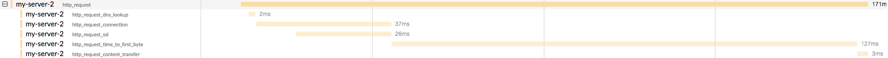

# opentracing-auto

[](https://travis-ci.org/RisingStack/opentracing-auto)  

Out of the box distributed tracing for [Node.js](https://nodejs.org) applications with OpenTracing.
Support multiple Tracers.

**WARNING: experimental library, do not use in production yet**

## Technologies

- [async_hooks](https://github.com/nodejs/node/blob/master/doc/api/async_hooks.md)
- [OpenTracing](http://opentracing.io/)

**Requirements**

- Node.js, >= v8

## Getting started

```sh
npm install @risingstack/opentracing-auto
```

```js
// must be in the first two lines of your application
const Instrument = require('@risingstack/opentracing-auto')
const { Tracer } = require('opentracing') // or any OpenTracing compatible tracer like jaeger-client
const tracer1 = new Tracer()
const tracer2 = new Tracer()

const instrument = new Instrument({
  tracers: [tracer1, tracer2]
})

// rest of your code
const express = require('express')
// ...
```

This package depends
on [require-in-the-middle](https://github.com/opbeat/require-in-the-middle)
and [shimmer](https://www.npmjs.com/package/shimmer) to monkeypatch tracing
information onto the modules [listed below](#Instrumentations). Therefore it is
crucial that you require() supported modules after creating the tracing
instrument.

If you are using node 8.5+'s experimental module support, you will need to
manually hook supported modules:

```js
import Instrument from '@risingstack/opentracing-auto';
import jaeger from 'jaeger-client';
import UDPSender from 'jaeger-client/dist/src/reporters/udp_sender';
import http from 'http';

const instrument = new Instrument({
  tracers: [
    new jaeger.Tracer(
      'my-service-name',
      new jaeger.RemoteReporter(new UDPSender.default({ host: 'my-jaeger-host' })),
      new jaeger.RateLimitingSampler(1),
      {}
    ),
  ],
});

instrument.hookModule(http, 'http');
```

## API

### new Instrument({ tracers: [tracer1, tracer2] })

Instrument modules.

- `tracers`: Array of OpenTracing compatible tracers
  - **required**
- `httpTimings`: Adds HTTP timings (DNS lookup, Connect, TLS, Time to first byte, Content transfer)
  - *default: false*

### instrument.unpatch()

Unpatch instrumentations

## Instrumentations

- [http, https](https://nodejs.org/api/http.html)
- [express](https://expressjs.com/)
- [restify](http://restify.com/)
- [mongodb-core](https://www.npmjs.com/package/mongodb-core)
- [pg](https://www.npmjs.com/package/pg)
- [mysql](https://www.npmjs.com/package/mysql)
- [redis](https://www.npmjs.com/package/redis)

## Example

The example require a running MongoDB and Jaeger.

**To start Jaeger and visit it's dashboard:**

```sh
docker run -d -p5775:5775/udp -p6831:6831/udp -p6832:6832/udp -p5778:5778 -p16686:16686 -p14268:14268 jaegertracing/all-in-one:latest && open http://localhost:16686
```

```sh
npm run example
curl http://localhost:3000
open http://localhost:16686
```


## HTTP timings

You can enable it with the `httpTimings: true`



## Debug

Start your application with the `DEBUG=opentracing-auto*` environment variable.

## Feature ideas

- More database instrumentation: Redis etc.
- More messaging layer instrumentation: HTTP/2, GRPC, RabbitMQ, Kafka etc.

## 3.x
- support koa 1.x